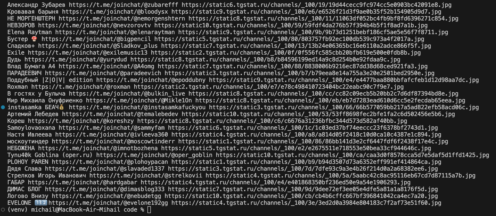

# tgstat_parsing
# Leetcode_Longest_Substring_Without_Repeating_Characters
>## Описание проекта
>проект получает логотопы телеграмм каналлов по заданным  и выводит названия и ссылки для подключения и ссылку на логотоп
>данные берутся с сайта: https://tgstat.ru

>## результаты работы кода
>

>## Стек
> 1. Python3
> 2. Makefile

>### Автор
>[Михаил Пономарёв](https://github.com/bizarrol423)
